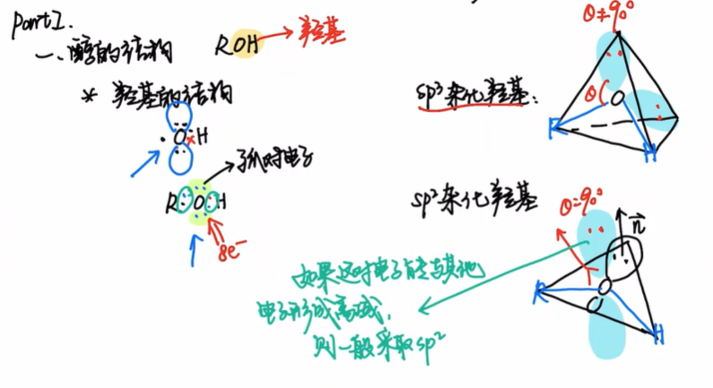
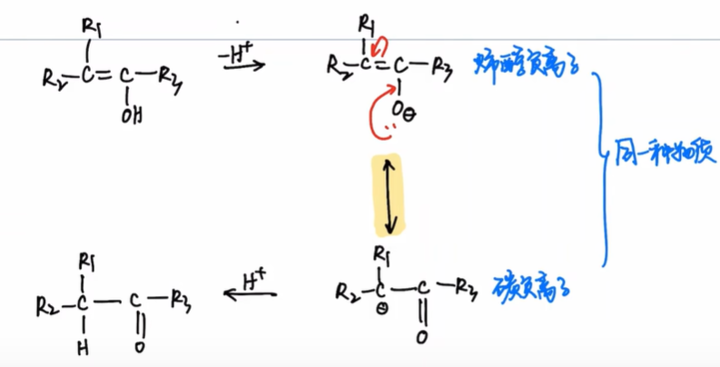
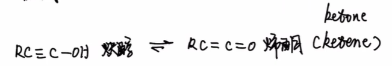

本文是[【基础有机化学 L9-2 醇的基本性质，醇的酸碱性和亲核性，醇与无机酸的反应】](https://www.bilibili.com/video/BV1D3411q7gW/?share_source=copy_web&vd_source=8df86ec0f66b0d7c70b7414a1a60bc6a) 的笔记
<!--more-->
## PartI:醇的结构
根据八隅体规则,醇的结构为$R-O-H$,其中O原子上有两对孤对电子.

受**电子效应**和**空间位阻效应**的影响,醇羟基氧的杂化方式可以为$sp^3/sp^2$
### 苯酚
在苯酚中,O原子采取$sp^2$杂化,这样O的孤对电子可以与苯环形成共轭,造成电子离域,体系能量下降.

### 苯酚负离子
在烯醇负离子中,羟基氧同样因为$p-\pi$共轭而采取$sp^2$杂化.

### 炔醇-烯酮

根据$\alpha-C$分类,醇可以分为一/二/三级醇.

## PartII:物理性质
1. 低级醇易溶,中级醇部分溶,高级醇不溶
2. 同碳数,叉链醇的沸点低
3. 低级醇的熔沸点比同碳数的烃更高