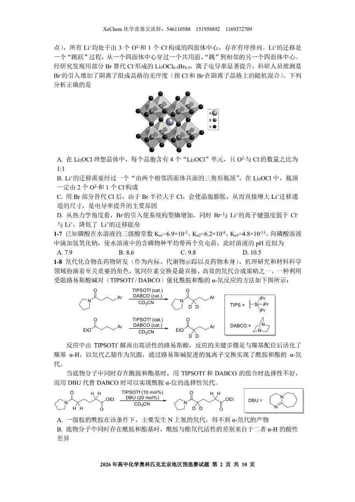
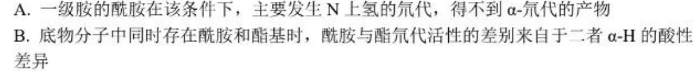
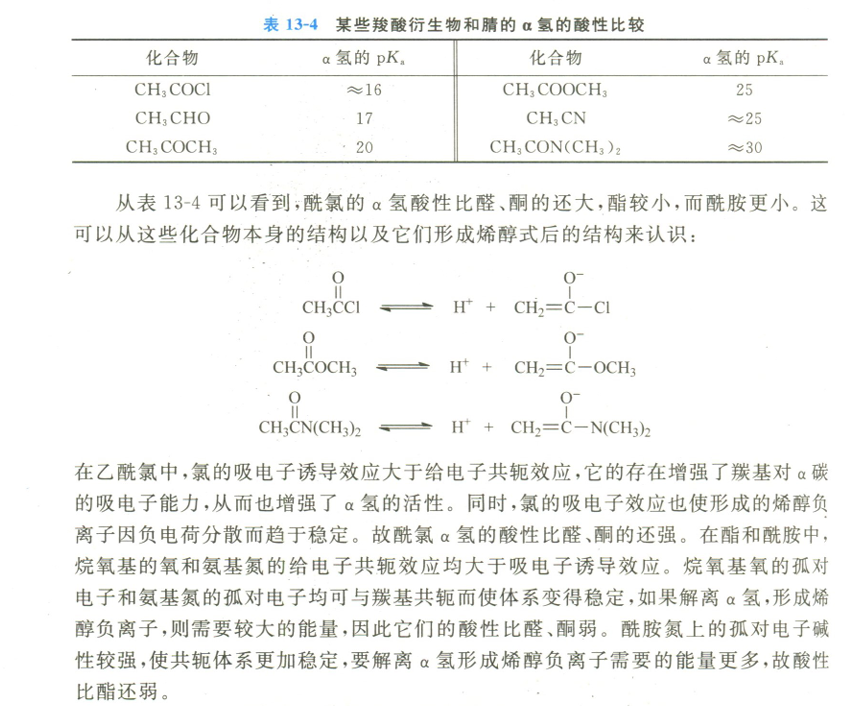
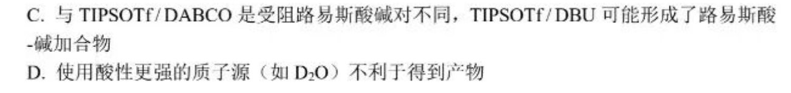
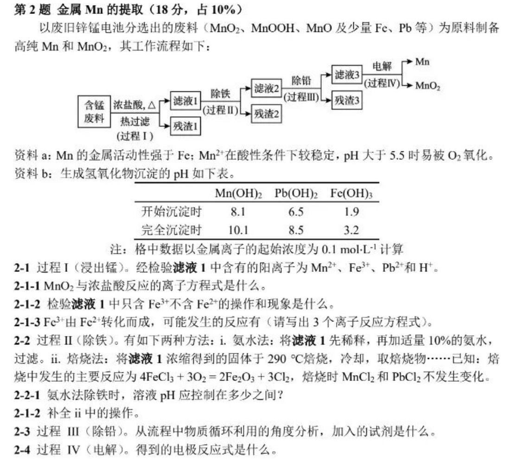

2026 年高中化学奥林匹克北京地区预选赛,没有难绷的元素推断,全是**化学基本理论**的运用与**热力学计算**.
<!--more-->

前五题答案:DCBAC

1-1简单题,不解释.

1-2:简单的元素性质

A:还原性顺序与阴离子元素非金属性顺序相反:

$\ce{HI\gt HBr\gt HCl\gt HF}$

B:通过与$\ce{H+}$配位的能力判断碱性顺序:

氮元素电负性小,$\ce{NH3}$碱性最强毫无疑问.

由于$\ce{-NH2}$的吸电子诱导效应,$\ce{N2H4}$碱性弱于$\ce{NH3}$,但又强于$\ce{H2O}$.

$\ce{HN3}$电离后形成的阴离子$\ce{N3-}$有两个$\Pi_3^4$离域派键,所以$\ce{HN3}$呈酸性,碱性最弱

C无比正确,D氧化性$\ce{ClO-}$最强(对称性低,键能小)

1-3简单电化学,不解释.

1-4: $\ce{NO}$分子的电子排布式:

$KK(\sigma_{2s})^2(\sigma_{2s}^*)^2(\pi_{2p_y})^2(\pi_{2p_z})^2(\sigma_{2p_x})^2(\pi_{2p_y}^*)^1$

复习一下,分子轨道的基本内容:

>KK表示有两对电子分别处于两个原子K层的1s轨道.相互重叠大的主要是原子的外层轨道,因此原子内层1s电子基本上维持了在原子轨道中的状态

B,C,N等元素由于2s,2p轨道能量差距小,会发生**sp混杂**,使$E(\pi_{2p})\lt E(\sigma_{2p})$(但注意π反键轨道和σ反键轨道能量顺序不改变)

这个有什么作用:
1. 解释$\ce{B2}$的**顺磁性**
2. 影响分子**HOMO**是什么
3. 解释$\ce{C2}$有两个π键,无σ键

A:$\ce{NO}$键级为2.5

| 键级 | $\ce{NO}$ | $\ce{NO+}$ | $\ce{NO-}$ |
| --- | --- | --- | --- |
| | 2.5 | 3 | 2 |

键长顺序与键级相反,键能顺序与键级相同

B正确,D正确.

$\ce{NO-}$分子电子排布式:

$KK(\sigma_{2s})^2(\sigma_{2s}^*)^2(\pi_{2p_y})^2(\pi_{2p_z})^2(\sigma_{2p_x})^2(\pi_{2p_y}^*)^1(\pi_{2p_z}^*)^1$

分子内有单电子,故有顺磁性(同理$\ce{O2}$也有顺磁性),C正确.综上选A

1-5 1-6晶体题仍然坐牢,直接跳过

6-8答案DCB

1-7简单水溶液计算,使用分布分数

$$
\begin{gathered}
  3\delta(\ce{PO4^3-})+2\delta(\ce{HPO4^2-})+\delta(\ce{H2PO4-})\\
=\frac{3K_{a1}K_{a2}K_{a3}+2K_{a1}K_{a2}[\ce{H+}]+K_{a1}[\ce{H+}]^2}{K_{a1}K_{a2}K_{a3}+K_{a1}K_{a2}[\ce{H+}]+K_{a1}[\ce{H+}]^2}\\
=2
\end{gathered}
$$
敲一下Casio,解得$\ce{[H+]}=1.73\times10^{-10},pH=9.76$

或者由于$\delta(\ce{H2PO4-})=\delta(\ce{PO4^3-})$,$\ce{[H+]}=\sqrt{K_{a2}K_{a3}}=1.73\times10^{-10}$也可以

1-8:

A:酰胺基中$\ce{N-H}$键的酸性显著强于$\ce{\alpha-C-H}$键,所以在Lewis碱作用下,$\ce{N-H}$中氢离子会优先解离,然后在**氘代试剂**环境下发生**氢氘交换**.

B:观察DBU作用下的反应,发现酰胺的$\ce{\alpha-H}$先发生了**氢氘交换**,而酯基$\ce{\alpha-H}$没有变化.这似乎与$\ce{\alpha-H}$酸性的顺序相反?

>反应中由TIPSOTf解离出高活性的路易斯酸，反应的关键步骤是与羰基配位后活化了羰基$\ce{\alpha-H}$，以氘代乙腈作为氘源，通过路易斯碱促进的氢离子交换实现了酰胺和酯的$\ce{\alpha}$-氘代

问题就出在这里.由于**羰基氧碱性**:酰胺>酯(为什么?通过共振式判断),所以酰胺的羰基氧更容易和Lewis碱配位,从而形成**氧鎓离子**,大大增强了$\ce{\alpha-H}$酸性,导致发生氘代,而不是因为本身$\ce{\alpha-H}$酸性强.B错误

Lewis酸碱加合物是什么?按照我的理解,是Lewis酸和Lewis碱结合,协同进攻底物,一个配位酰胺羰基氧,一个拔$\ce{\alpha-H}$,促成催化下酰胺$\ce{\alpha-H}$的氘代(否则正常情况下,是酯基$\ce{\alpha-H}$氘代),C正确.

D.质子源酸性过强,可能直接质子化所用的Lewis碱,所以D正确.

2-1简单题

2-2-1 $\ce{Fe^3+}$完全沉淀,同时不能让$\ce{Mn^2+}$被氧气氧化,也不能让$\ce{Pb^2+,Mn^2+}$沉淀,所以调pH 3.2-5.5

2-2-2 加水溶解,过滤,**再加盐酸酸化至pH小于5.5**

2-3 不能通过沉淀Pb的方法除铅(否则$\ce{Pb^2+}$完全沉淀时,$\ce{Mn^2+}$已开始沉淀),因为Mn的金属活动性强于Fe,所以**加Mn**还原$\ce{Pb^2+}$.

3热力学与动力学简单计算,跳过

