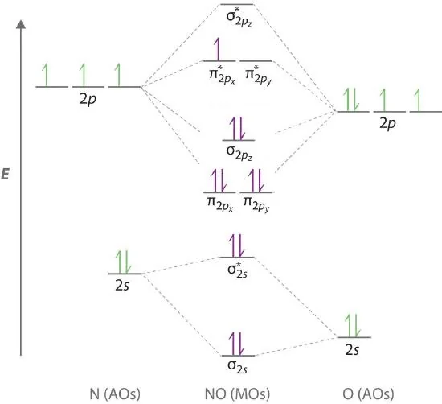

2026 年高中化学奥林匹克北京地区预选赛,没有难绷的元素推断,全是**化学基本理论**的运用与**热力学计算**,符合我的口味.

可以给到"夯"的分数.
<!--more-->

前五题答案:DCBAC

1-1弱智题,不解释.

1-2:简单的元素性质

A:还原性顺序与阴离子元素非金属性顺序相反:

$\ce{HI\gt HBr\gt HCl\gt HF}$

B:通过与$\ce{H+}$配位的能力判断碱性顺序:

氮元素电负性小,$\ce{NH3}$碱性最强毫无疑问.

由于$\ce{-NH2}$的吸电子诱导效应,$\ce{N2H4}$碱性弱于$\ce{NH3}$,但又强于$\ce{H2O}$.

$\ce{HN3}$电离后形成的阴离子$\ce{N3-}$有两个$\Pi_3^4$离域派键,所以$\ce{HN3}$呈酸性,碱性最弱

C无比正确,D氧化性$\ce{ClO-}$最强(对称性低,键能小)

1-3简单电化学,不解释.

1-4: $\ce{NO}$分子的电子排布式:

$KK(\sigma_{2s})^2(\sigma_{2s}^*)^2(\pi_{2p_y})^2(\pi_{2p_z})^2(\sigma_{2p_x})^2(\pi_{2p_y}^*)^1$

复习一下,分子轨道的基本内容:

>KK表示有两对电子分别处于两个原子K层的1s轨道.相互重叠大的主要是原子的外层轨道,因此原子内层1s电子基本上维持了在原子轨道中的状态

B,C,N等元素由于2s,2p轨道能量差距小,会发生**sp混杂**,使$E(\pi_{2p})\lt E(\sigma_{2p})$(但注意π反键轨道和σ反键轨道能量顺序不改变)

这个有什么作用:
1. 解释$\ce{B2}$的**顺磁性**
2. 影响分子HOMO是什么
3. 解释$\ce{C2}$有两个π键,无σ键

A:$\ce{NO}$键级为2.5

| 键级 | $\ce{NO}$ | $\ce{NO+}$ | $\ce{NO-}$ |
| --- | --- | --- | --- |
| | 2.5 | 3 | 2 |

键长顺序与键级相反,键能顺序与键级相同

B正确,D正确.

$\ce{NO-}$分子电子排布式:

$KK(\sigma_{2s})^2(\sigma_{2s}^*)^2(\pi_{2p_y})^2(\pi_{2p_z})^2(\sigma_{2p_x})^2(\pi_{2p_y}^*)^1(\pi_{2p_z}^*)^1$

分子内有单电子,故有顺磁性(同理$\ce{O2}$也有顺磁性),C正确.综上选A

1-5晶体题仍然坐牢,直接跳过