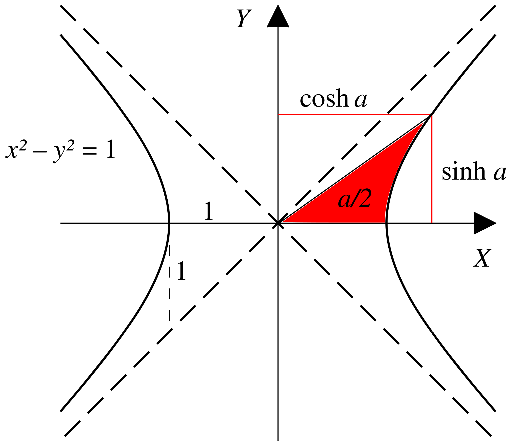

<!--more-->
### 例1:解析代数
已知椭圆$C:\frac{x^2}{4}+\frac{y^2}{3}=1$,函数$y=m^{x+1}+n(m\ge 2)$交椭圆于$A,B$两点，求$n$的最大值。

设$A(x_0,y_0),B(-x_0,-y_0),x_0\in(0,2),y_0\in(0,\sqrt{3})$，有：

$\begin{cases}
  y_0=m^{x_0+1}+n,(1)\\
  -y_0=m^{-x_0+1}+n,(2)\\
  \frac{x_0^2}{4}+\frac{y_0^2}{3}=1,(3)
\end{cases}$

考虑到一共有$x_0,y_0,m,n$四个变量，以及三个约束条件，故有$4-3=1$个自由度.

显然如果可以确定其中一个变量的范围，其他变量的范围便迎刃而解:

为了在得到**恒等变形**的同时**利用对称性**，考虑(1)+(2)和(1)-(2)，则**充要条件**为:

$$\begin{cases}
  -2n=m(m^{x_0}+m^{-x_0}),(4)\\
  2y_0=m(m^{x_0}-m^{-x_0}),(5)\\
  \frac{x_0^2}{4}+\frac{y_0^2}{3}=1,(3)
\end{cases}$$

做几个简单的观察:
- 由(4)不难看出$n\lt 0$.
- 在(4)中,$m^{x_0}\gt 1$,则$m$越大,$-2n$越小,$n$越大
- (5)中m越大，2y_0越小，且$m\ge 2$,通过放缩可以消去$m$

于是，我们进一步进行**无损放缩**(m=2):

$$\begin{cases}
  -2n\ge 2(2^{x_0}+2^{-x_0}),(6)\\
  2y_0\ge 2(2^{x_0}-2^{-x_0}),(7)\\
  \frac{x_0^2}{4}+\frac{y_0^2}{3}=1\ge \frac{x_0^2}{4}+\frac{2^{2x_0}+2^{-2x_0}-2}{3},(\alpha)
\end{cases}$$

($\alpha$)正是解题的关键！不难看出$\frac{x_0^2}{4}+\frac{2^{2x_0}+2^{-2x_0}-2}{3}$关于$x_0$单调递增，解得$x_0\le 1$.

于是根据(6)有:

$$\begin{gathered}
  n\le -(2^{x_0}+2^{-x_0})\le -\frac{5}{2}
\end{gathered}$$

## 数学背景:双曲三角函数

双曲三角函数由双曲线$x^2-y^2=1$导出，故称为**双曲函数**

$$\begin{cases}
  \sinh x=\frac{e^x-e^{-x}}{2},\\
  \cosh x=\frac{e^x+e^{-x}}{2}\ge 1,\\
  \tanh x=\frac{\sinh x}{\cosh x}=\frac{e^x-e^{-x}}{e^x+e^{-x}}\lt 1
\end{cases}$$

类似于三角函数，双曲函数有对应的恒等变换公式:

$$\begin{gathered}
  \cosh^2 x-\sinh^2 x=1,\\
  \cosh^2 x+\sinh^2 x=\cosh 2x,\\
  \sinh(x+y)=\sinh x\cosh y+\cosh x\sinh y\\
  \sinh(x-y)=\sinh x\cosh y-\cosh x\sinh y\\
  \cosh(x+y)=\cosh x\cosh y+\sinh x\sinh y\\
  \cosh(x-y)=\cosh x\cosh y-\sinh x\sinh y\\
  \tanh(x+y)=\frac{\tanh x+\tanh y}{1+\tanh x\tanh y}\\
  \tanh(x-y)=\frac{\tanh x-\tanh y}{1-\tanh x\tanh y}\\
\end{gathered}$$

详细内容见[维基百科](https://zh.wikipedia.org/wiki/%E5%8F%8C%E6%9B%B2%E5%87%BD%E6%95%B0)

处理例一(4)(5)时，也可以类比$\cosh^2 x-\sinh^2 x=1$,考虑平方再相加

### 例2
若$f(x)=a^{x-1}$和$g(x)=\log_a x+1$有三个交点，求$a$的取值范围:

当$a\gt 1$时，$f(x)=a^{x-1}$单调递增，且$f(x),g(x)$互为反函数，那么假如交点不在$y=x$上:

设交点为$(x,y)$,则必有成对的交点$(y,x)$,只要$x\neq y$,则与单调性矛盾.

这意味着$y=a^{x-1}$作为一个下凸函数与$y=x$有两个交点，显然推出矛盾:

故$0\lt a\lt 1$,此时显然有一个交点$(1,1)$，而另外两个交点都不能在$y=x$上，则两个配对的交点都不在$y=x$上，有一对$(x,y),(y,x)$为符合题意的交点:

$$\begin{cases}
  a^{x-1}=\log_a y+1,(1)\\
  a^{y-1}=\log_a x+1,(2)
\end{cases}$$

仿照例1,考虑(1)+(2)和(1)-(2):

$$\begin{cases}
  a^{x-1}+a^{y-1}=a^{x-1}(1+a^{y-x})=\log_a xy+2,(3)\\
  a^{x-1}-a^{y-1}=a^{x-1}(1-a^{y-x})=\log_a \frac{x}{y},(3)\\
\end{cases}$$