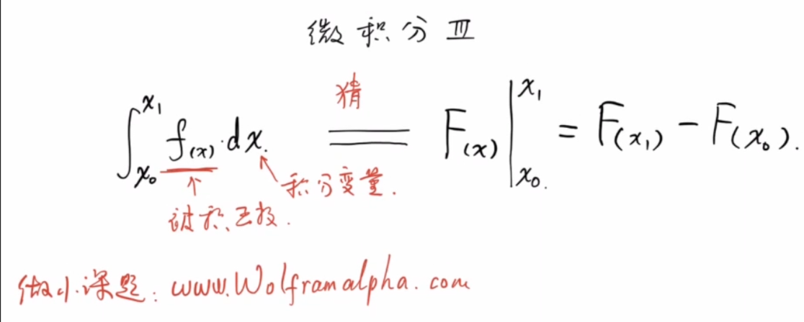

## 朝花夕拾

### 例1
有一个质量均匀的圆锥，其母线与高的夹角为$\theta$，底面半径为$r$,密度为$\rho$.

(1)求总质量

(2)求重心位置

设原点为锥顶，圆锥的高为x轴

(1)

$$\begin{gathered}
dm=\rho Sdh\\
=\pi\rho (h\tan\theta)^2dh\\
m=\int dm\\
=\pi\rho\tan^2\theta\int_0^{r\cot\theta}h^2dh\\
=\pi\rho\tan^2\theta\left(\frac{1}{3}h^3)\right|_0^{r\cot\theta}\\
=\frac{1}{3}\pi\rho r^3\cot\theta
\end{gathered}$$

(2)

由对称性知，重心在圆锥的高上.

$$\begin{gathered}
x_c=\frac{\int m_ix_i}{m}\\
=\frac{\int_0^{r\cot\theta}\pi\rho\tan^2\theta x^3dx}{m}\\
=\frac{\pi\rho\tan^2\theta\int_0^{r\cot\theta}x^3dx}{\frac{1}{3}\pi\rho r^3\cot\theta}\\
=3\frac{\tan^3\theta}{r^3}\frac{(r\cot\theta)^4}{4}\\
=\frac{3}{4}r\cot\theta
\end{gathered}$$
