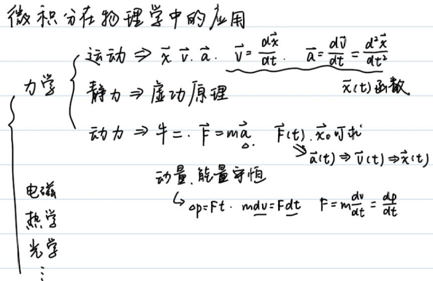
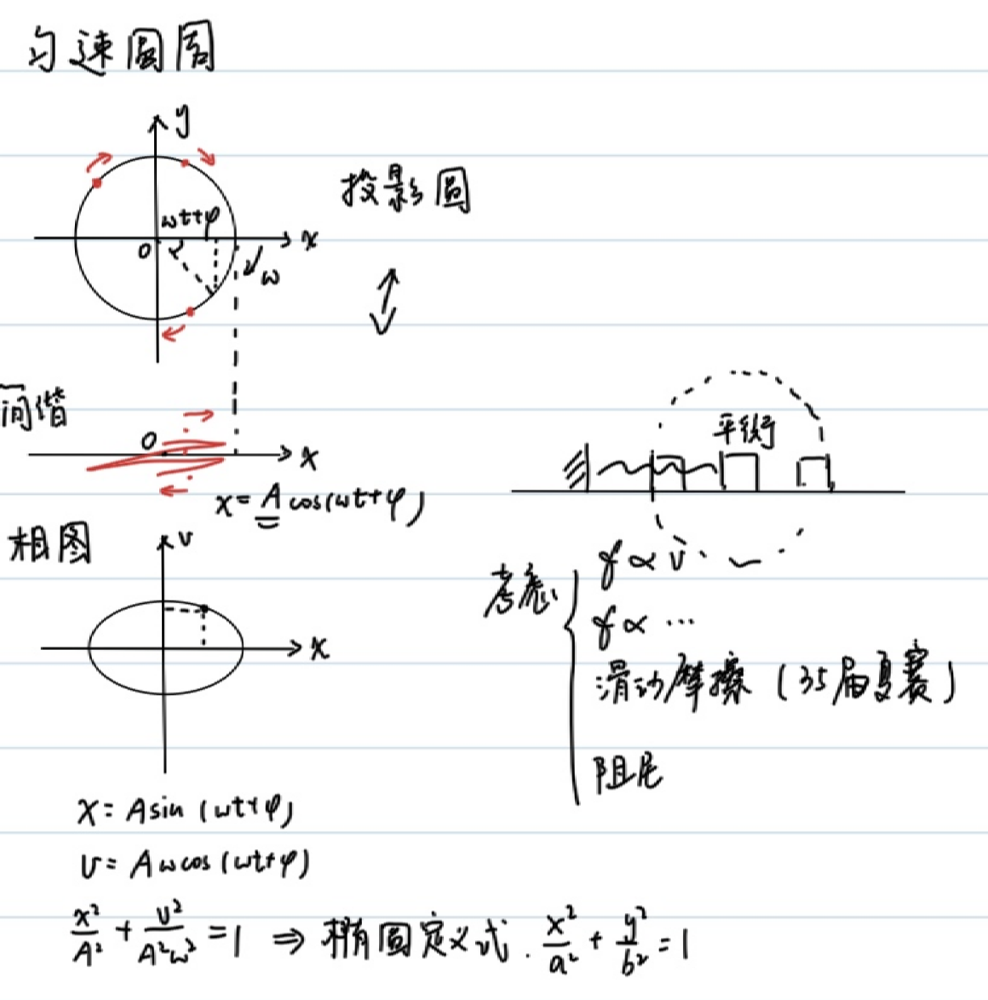
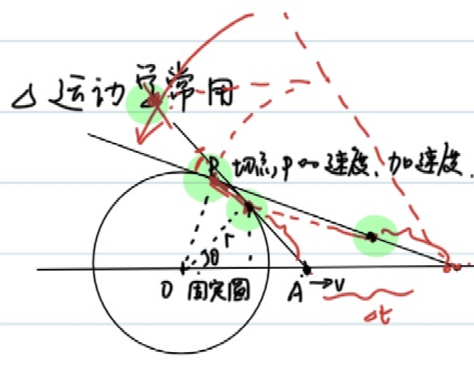
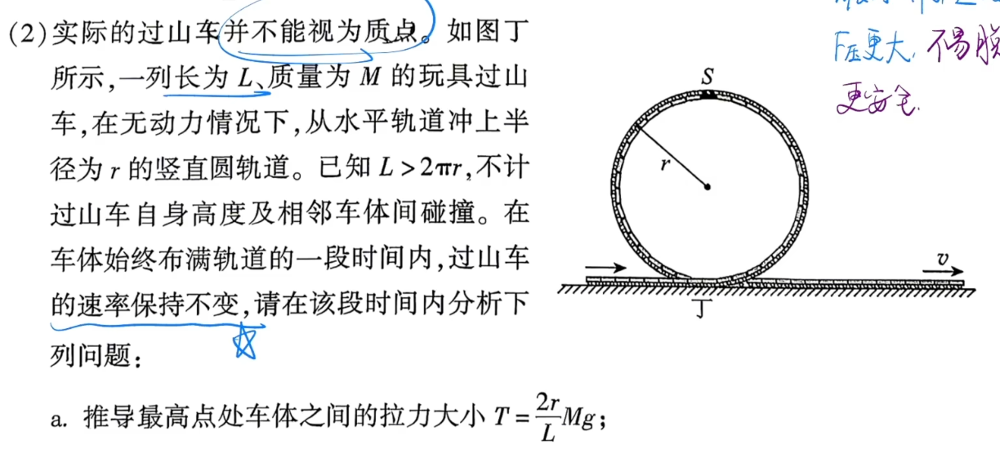

<!--more-->
### 例1
$$\begin{gathered}
  mgh+\frac{1}{2}mv^2=C\\
  v=\frac{dh}{dt}\\
  mgh+\frac{1}{2}m(\frac{dh}{dt})^2=C\\
  \frac{dh}{dt}=\sqrt{\frac{2(C-mgh)}{m}}\\
  dt=\sqrt{\frac{m}{2(C-mgh)}}dh=\frac{\sqrt{2}}{2}(\frac{c}{m}-gh)^\frac{-1}{2}dh\\
  \int_0^t dt=\frac{\sqrt{2}}{2}\int_{h_0}^{h_t}(\frac{c}{m}-gh)^\frac{-1}{2}dh\\
  t=-\frac{\sqrt{2}}{g}(\frac{C}{m}-gh_t)^\frac{1}{2}+C'
\end{gathered}$$

### 例2
在简谐运动中：

$$\begin{gathered}
  \vec{F}=-k\vec{x},\vec{v}=\frac{d\vec{x}}{dt},\vec{a}=\frac{d\vec{v}}{dt}=\frac{d^2\vec{x}}{dt^2}=\frac{-k}{m}x
\end{gathered}$$

构建的微分方程:

$$\frac{d^2\vec{x}}{dt^2}=\frac{-k}{m}x$$

备选的$x(t)$:
- $A\cos (\omega t+\phi)$
- $A\sin (\omega t+\phi)$
- $e^{\omega t+\phi}$

但$\frac{-k}{m}\lt 0$,可以排除$e^{\omega t+\phi}$

设$x(t)=A\sin (\omega t+\phi)$,则:

$$\begin{gathered}
  v(t)=Aw\cos(\omega t+\phi)\\
  a(t)=-Aw^2\sin(\omega t+\phi)=\frac{-k}{m}A\sin(\omega t+\phi)
\end{gathered}$$

解得:$\omega=\sqrt{\frac{k}{m}},\phi=\arcsin\frac{x_0}{A}$

结合机械能守恒,可以推出弹簧弹性势能的表达式:

在弹簧振子位于平衡位置时，设$E_{p_0}=0$，弹性势能最小，速度最大.

$$\begin{gathered}
  \frac{1}{2}mv^2+E_p=C\\
  \omega=\sqrt{\frac{k}{m}}\\
  v(t)=Aw\cos(\omega t+\phi)\\
  C=\frac{1}{2}m(Aw)^2
\end{gathered}$$

解得:$E_p=\frac{1}{2}m(Aw\sin(\omega t+\phi))^2=\frac{1}{2}kx^2$

>[!NOTE]
>熟知简谐运动可以与匀速圆周运动一一对应
>
>圆上的一个点可以确定运动的**位移**与**速度**的**大小及方向**

对于简谐运动，如果做出$v-x$图，那么图像将会是椭圆：

$$\begin{cases}
  x=A\sin(\omega t+\phi)\\
  y=A\omega\cos(\omega t+\phi)\\
  \frac{x^2}{A^2}+\frac{y^2}{A^2\omega^2}=1
\end{cases}$$

### 例3
(35届复赛第二题-简化版)

首先，为了在一开始能运动，必须满足:

$$\begin{gathered}
  kA_0\gt \mu mg\\
  A_0\gt \frac{\mu mg}{k}
\end{gathered}$$

再列出运动过程的能量守恒:

$$\begin{cases}
  \frac{1}{2}kA_0^2=\frac{1}{2}kx^2+(A_0+x)\mu mg,\\
  kx\lt \mu mg \rightarrow x\in (0,\frac{\mu mg}{k})
\end{cases}$$

解得:

$$\begin{gathered}
  A_0^2=x^2+\frac{2}{k}(A_0+x)\mu mg\in (\frac{2\mu mg}{k}A_0,\frac{2\mu mg}{k}A_0+\frac{3\mu^2 m^2g^2}{k^2})
\end{gathered}$$

即:

$$\begin{gathered}
  (A_0-\frac{\mu mg}{k})^2\in (\frac{\mu^2 m^2g^2}{k^2},\frac{4\mu^2 m^2g^2}{k^2})
\end{gathered}$$

(Aha)最后得到:

$A_0\in (\frac{2\mu mg}{k},\frac{3\mu mg}{k})$

另解:(合成弹力和摩擦力，利用简谐运动的对称性)

## 曲率半径
一个曲线运动可以看成若干圆周运动的加和，各物理量满足:

$$\begin{cases}
  \vec{F}=m\frac{\vec{v}^2}{\rho},\\
  \vec{a_n}=\frac{\vec{v}^2}{\rho}\hat{n},\\
  a_n = \frac{|\vec{a} \times \vec{v}|}{|\vec{v}|}, \quad a_t = \frac{\vec{a} \cdot \vec{v}}{|\vec{v}|}
\end{cases}$$

### 例4
求抛物线$y=x^2$在$x=0$处的曲率半径

$$\begin{gathered}
  \vec{r}=(x,x^2)\\
  \vec{v}=(\frac{dx}{dt},2x\frac{dx}{dt})\\
  \vec{a}=(\frac{d^2x}{dt^2},2(\frac{dx}{dt})^2+2x\frac{d^2x}{dt^2})
\end{gathered}$$

不妨设$\frac{dx}{dt}=1$,即质点在水平方向作匀速运动，在$x=0$处，向心加速度沿y轴方向，切向加速度为0:

$a_n=|\vec{a}|=2,\vec{v}=(1,0),|v|=1,\rho=\frac{v^2}{a_n}=\frac{1}{2}$
### 例5
已知椭圆$\frac{x^2}{a^2}+\frac{y^2}{b^2}=1(a>b>0)$,求端点处的曲率半径.

如果设水平速度恒定，会导致在长轴处出现问题;设竖直速度恒定，短轴处也会出问题

我们采取极坐标换元:

$$\begin{gathered}
\vec{x}=(a\cos(\omega t+\phi),b\sin(\omega t+\phi))\\
\vec{v}=(-a\omega\sin(\omega t+\phi),b\omega\cos(\omega t+\phi))\\
\vec{a}=(-a\omega^2\cos(\omega t+\phi),-b\omega^2\sin(\omega t+\phi))
\end{gathered}$$

在$(0,b)$处，$\omega t+\phi=\frac{\pi}{2}$.

$$\begin{gathered}
  \vec{v}=(-a\omega,0)\\
  \vec{a_n}=\vec{a}=(0,-b\omega^2)\\
  \rho=\frac{|v|^2}{|a_n|}=\frac{a^2}{b}
\end{gathered}$$

在$(a,0)$处，$\omega t+\phi=0$.

$$\begin{gathered}
  \vec{v}=(0,b\omega)\\
  \vec{a_n}=\vec{a}=(-a\omega^2,0)\\
  \rho=\frac{|v|^2}{|a_n|}=\frac{b^2}{a}
\end{gathered}$$

### 例6
一根支在固定圆上的长木棍，一端A在地面上做速度为$v$的匀速运动，求交点P与接触点E速度.

$$\begin{gathered}
  A(x,0)\\
  \frac{dx}{dt}=v\\
  P(\frac{r^2}{x},r\sqrt{1-\frac{r^2}{x^2}})\\
  \vec{v_p}=(v\frac{-r^2}{x^2},v\frac{r^3}{x^3}\frac{1}{\sqrt{1-\frac{r^2}{x^2}}})
\end{gathered}$$

类似的，我们求接触点E速度。注意接触点的约束条件不是在圆上，而是到A点距离不变。

$$\begin{gathered}
\vec{AP}=(\frac{r^2}{x}-x,r\sqrt{1-\frac{r^2}{x^2}})\\
|AP|=\sqrt{x^2-r^2}\\
\vec{l}=\frac{\vec{AP}}{|AP|}=(-\frac{\sqrt{x^2-r^2}}{x},\frac{r}{x})\\
E=A+|AP|\\
E'(t)=A'+|AP|\vec{l}'\\
=(v,0)+\sqrt{x^2-r^2}(-v\frac{2r^2}{x^3}\frac{1}{2\sqrt{1^2-\frac{r^2}{x^2}^2}},-v\frac{r}{x^2})\\
=(v(1-\frac{r^2}{x^2}),-v\frac{r}{x^2}\sqrt{x^2-r^2})
\end{gathered}$$

### 例7(虚功原理)
有一个圆上，其半圆部分放有均匀细绳，质量为$m$,求顶点处的张力。

对无数微小质元受力分析，考虑沿切线方向受力平衡:

$$\begin{gathered}
  dF=\frac{d\theta}{\pi}mg\cos \theta\\
  \int_{0}^{F}=\frac{mg}{\pi}\int_{0}^\frac{\pi}{2}\cos\theta d\theta\\
  =\frac{mg}{\pi}
\end{gathered}$$

当然，我们有一个技巧性强的做法：**虚功原理**.

缓慢把绳拉动$\Delta x$,$F\Delta x=\frac{\Delta x}{\pi R}mgR$,则$F=\frac{mg}{\pi}$

使用虚功原理，可以较容易地解决2026朝阳高三二模T19(2)