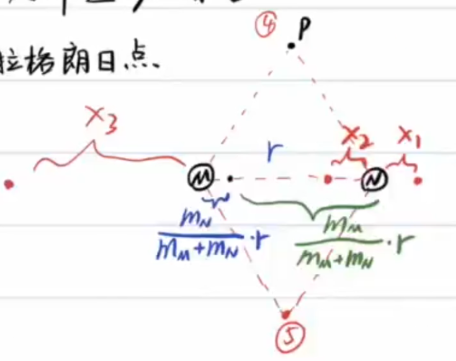
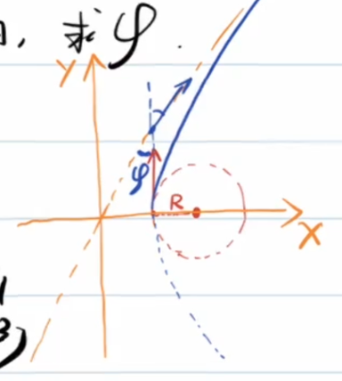
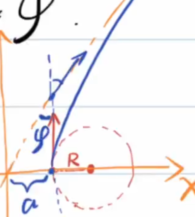

<!--more-->
# 天体运动综合
## 一:拉格朗日点
三个天体M,N,P,满足$m_M\gt\gt m_N\gt m_P$

请问空间中存在几个点,使得P在该点能相对M,N静止(M,N,P形成稳定转动)

由万有引力定律中的朝花夕拾,知:

如果P,M,N不共线,则P,M,N形成正三角形,这样便找出了2个点.

以M,N为转动惯性系,则P受到由M,N质心指向P的离心力和M,N对P的引力.

由于$m_M\gt\gt m_N\gt m_P$,近似认为三者旋转的中心为M,N质心

#### 情况一
从左向右,分别为M,N,P
$$\begin{gathered}
  \frac{Gm_Pm_M}{(r+x_1)^2}+\frac{Gm_Pm_N}{x_1^2}=m_Pw^2(r+x_1)\\
  G\frac{m_Mm_N}{r^2}=m_Nw^2r\frac{m_M}{m_M+m_N}\\
  \frac{Gm_M}{(r+x_1)^2}+\frac{Gm_N}{x_1^2}=G\frac{m_M+m_N}{r^3}(r+x_1)\\
  m_M(3r^2x_1^3+3rx_1^4+x_1^5)=m_N(r^5+2r^4x_1-3r^2x_1^3-3rx_1^4-x_1^5)\\
\end{gathered}$$

这里引入一种小量近似的方法:我们先假设$x_1$相对$r$为小量,然后检查结果的合理性.

$$\begin{gathered}
  m_M(3r^2x_1^3)=m_Nr^5\\
  x_1=\sqrt[3]{\frac{m_N}{3m_M}}r\lt\lt r
\end{gathered}$$

小量近似合理.

#### 情况二
$$\begin{gathered}
  \frac{Gm_Pm_M}{(r-x_2)^2}-\frac{Gm_pm_N}{x_2^2}=m_Pw^2(r-x_2)\\
  \frac{Gm_Pm_M}{(r-x_2)^2}-\frac{Gm_pm_N}{x_2^2}=\frac{Gm_P(m_M+m_N)}{r^3}(r-x_2)\\
\end{gathered}$$

类似有:$x_2=\sqrt[3]{\frac{m_N}{3m_M}}r$
#### 情况三
由于$m_N\lt\lt m_M$且P离M更近,N对于P的引力可以忽略,显然得$x_2=r$

### 例1

如图，设想一根“天梯”沿地月连线方向放置：左端靠近地球，右端靠近月球，但两端都不接触地球或月球，均悬在空间中。

已知：s

- 地月距离为 $r$；
- 天梯可视为均匀细杆；
- 天梯材料密度为 $\rho$；
- 天梯横截面积为 $S$；
- 地球表面重力加速度为 $g$；
- 月球表面重力加速度为 $g_{\text{月}}$；
- 地球半径为 $R_{\text{地}}$；
- 月球半径为 $R_{\text{月}}$。

## 问题

1. 若要求天梯相对地月系统保持静止，并且天梯两端都悬空，那么需要在天梯某一端挂一个配重。  
   这个配重应该挂在靠近地球的一端，还是靠近月球的一端？

2. 天梯上哪一点最容易被拉断？  
   试说明它与地月系统中的拉格朗日点有什么关系。

(1)以地月连线为系,引入惯性力

先考虑无配重情况下,杆受的合外力.

直接求解较为困难,考虑**虚功原理**:

考虑这个过程:用一个虚拟的力$F$(正方向向月球)把天梯向月球端移动一小段距离$\Delta L$

一开始,系统的转动中心近似在地心附近,故一开始地球端一小段的离心势能(由于惯性离心力做功而产生的势能)接近于0.

$$\begin{gathered}
  \Delta E=F\Delta L=\rho S\Delta L[(0-(-\frac{GM_e}{R_e}))+(-\frac{GM_m}{R_m}-0)]+(-\frac{1}{2}w^2r^2\rho S\Delta L-0)\\
  F\gt\gt 0
\end{gathered}$$

所以,得到木杆所受合外力向地球.应该在月球端放一个配重,以受到月球更大的引力.

(2)可以发现,以月地连线为系,在中间的拉格朗日点左边,天梯所受的引力和离心力的合力向左;在中间的拉格朗日点右边,天梯所受的引力和离心力的合力向右

每一部分向左的力会累加,每一部分向右的力也会累加,所以在中间的拉格朗日点所受的左右拉力差最大,最容易断裂.

## 二:双曲线轨道
机械能$E\gt 0$,双曲线方程$\frac{x^2}{a^2}-\frac{y^2}{b^2}=1$.

### 例1
有一宇宙飞船绕一行星做匀速直线运动,轨道半径为$R$,飞船速率为$v_0$. 飞船突然点火,飞船从$v_0$加速到$\sqrt{3}v_0$,加速度方向与速度方向相同. 这样,飞船沿着新轨道运动. 设$\varphi$为由发动机点火时飞船速度方向与飞船里行星最远处时的速度方向之夹角(究极长难句)

由位力定理可得:

$$\begin{gathered}
  E_0=\frac{1}{2}mv^2+(-\frac{GMm}{r})\\
  -\frac{GMm}{r}=-mv^2\\
  E=E_0+\frac{1}{2}m[(\sqrt{3}v)^2-v^2]=\frac{1}{2}mv^2\gt 0
\end{gathered}$$

易知飞船新的运动轨道为双曲线,最终速度接近于渐进线方向,只需要求双曲线离心率即可确定之.

熟知天体运动的轨道方程为:

$$\boxed{\frac{\frac{L^2}{GMm^2}}{1+\sqrt{1+\frac{2EL^2}{G^2M^2m^3}}\cos\theta}}$$

$$\begin{gathered}
  e_0=\sqrt{1+\frac{2E_0L_0^2}{G^2M^2m^3}}=0\\
  \frac{2E_0L_0^2}{G^2M^2m^3}=-1\\
  E=-E_0,L=\sqrt{3}L_0\\
  \frac{2EL^2}{G^2M^2m^3}=3\\
  e=2=\sec(90\degree-\varphi)\\
  \varphi=30\degree
\end{gathered}$$

不那么依赖二级结论的方法:

$$\begin{gathered}
  \frac{1}{2}m(\sqrt{3}v_0)^2-mv_0^2=0+\frac{1}{2}mv^2\\
  m\sqrt{3}v_0R=mvb\\
  (R+a)\sin\varphi=a\\
  b=(R+a)\cos\varphi\\
  \frac{\cos\varphi}{1-\sin\varphi}=\sqrt{3}\\
  \varphi=30\degree
\end{gathered}$$